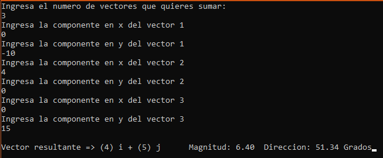
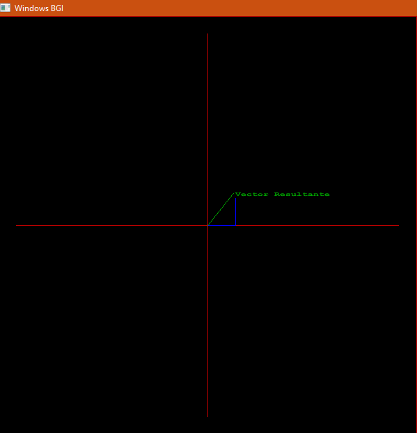

# SumaVectores
Calculadora que puede sumar N vectores bidimensionales en su forma de componente vectorial y representar su vector resultante en una cuadricula de 600px*600px

## Problema

Una persona maneja un automovil siguiendo este patron 10 km al sur, luego 4 km al este y finalmente 15 km al norte.
¿Qué distancia y en que dirección debera volar una avioneta en línea recta para llegar al mismo punto final?

## Solución del problema

Usando la calculadora podemos calcular el vector posición usando sus movimientos, interprentando asi su primer movimiento como el **vector (0)i + (-10)j**, el segundo vector como **(4)i + (0)j** y finalmente el tercer vector como **(0)i + (15)j**.

Así que indicaremos que queremos sumar 3 vectores introduciremos las componentes en el orden siguiente:

- Componente en x del vector 1: 0
- Componente en y del vector 1: -10
- Componente en x del vector 2: 4
- Componente en y del vector 2: 0
- Componente en x del vector 3: 0
- Componente en y del vector 3: 15

Dandonos como resultado el vector (4)i + (5)j con magnitud de 6.40 y dirección de 51.34 grados.

Este resultado nos indica que la avioneta deberá volar 6.4 km con un ángulo de 51.34 grados sobre el eje horizontal positivo, que en este caso seria el este.
